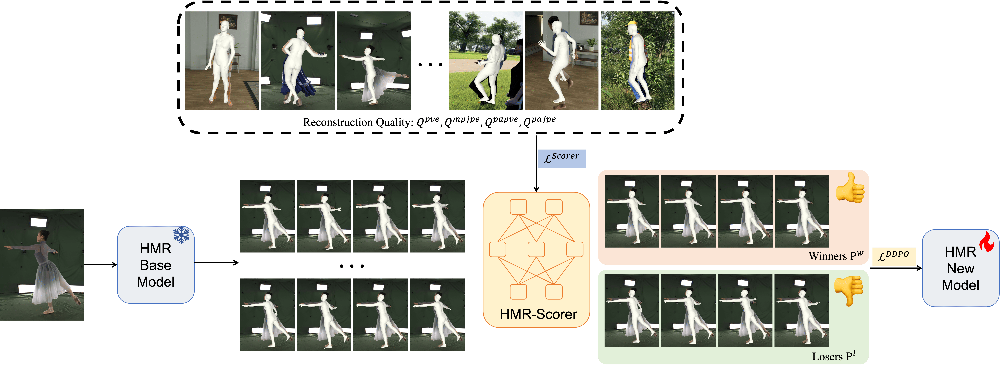

<div align="center">

# ADHMR: Aligning Diffusion-based Human Mesh Recovery via Direct Preference Optimization

<div>
    <a href='https://shenwenhao01.github.io/' target='_blank'>Wenhao Shen</a>&emsp;
    <a href='https://scholar.google.com/citations?user=zlIJwBEAAAAJ&hl=en' target='_blank'>Wanqi Yin</a>&emsp;
    <a href='https://xfyang.net/' target='_blank'>Xiaofeng Yang</a>&emsp;
    <a href='https://scholar.google.com/citations?user=nNQU71kAAAAJ&hl=zh-CN' target='_blank'>Cheng Chen</a>&emsp;
    <a href='https://chaoyuesong.github.io/' target='_blank'>Chaoyue Song</a>&emsp;
    <a href='https://caizhongang.github.io/' target='_blank'>Zhongang Cai</a>&emsp;
    <a href='https://yanglei.me/' target='_blank'>Lei Yang</a>&emsp;
    <a href='https://wanghao.tech/' target='_blank'>Hao Wang</a>&emsp;
    <a href='https://guosheng.github.io/' target='_blank'>Guosheng Lin</a>&emsp;
</div>

<strong><a href='https://icml.cc/virtual/2025/poster/43558' target='_blank'>ICML 2025</a></strong>

<!-- <h4 align="center"> -->
  <!-- <a href="" target='_blank'>[arXiv]</a> • -->
  <!-- <a href="" target='_blank'>[Slides]</a> -->
<!-- </h4> -->

</div>

---

<p align="center">
  
</p>

---


## 🛠️ Install
<details>
<summary>Set up the environment</summary>


```bash
conda create -n adhmr python=3.8 -y
conda activate adhmr
conda install pytorch==1.12.0 torchvision==0.13.0 torchaudio==0.12.0 cudatoolkit=11.3 -c pytorch -y
pip install mmcv-full==1.7.1 -f https://download.openmmlab.com/mmcv/dist/cu113/torch1.12.0/index.html
pip install -r requirements.txt

# install pytorch3d
pip install "git+https://github.com/facebookresearch/pytorch3d.git"

# install mmpose
cd HMR-Scorer/main/transformer_utils
pip install -v -e .
cd -
```

</details>


<details>
<summary>HMR-Scorer</summary>

- ```cd HMR-Scorer/```
- download all datasets
  - [3DPW](https://virtualhumans.mpi-inf.mpg.de/3DPW/)
  - [Human3.6M](http://vision.imar.ro/human3.6m/description.php)     
  - [HI4D](https://yifeiyin04.github.io/Hi4D/)        
  - [BEDLAM](https://bedlam.is.tue.mpg.de/index.html)      
  - [RenBody (DNA-Rendering)](https://magichub.com/datasets/openxd-renbody/)
  - [GTA-Human](https://caizhongang.github.io/projects/GTA-Human/)           
  - [SPEC](https://spec.is.tue.mpg.de/index.html)
  - [InstaVariety](https://github.com/akanazawa/human_dynamics/blob/master/doc/insta_variety.md)         
- process all datasets into [HumanData](https://github.com/open-mmlab/mmhuman3d/blob/main/docs/human_data.md) format, except the following:
  - Human3.6M. 
  - follow [OSX](https://github.com/IDEA-Research/OSX) in preparing this dataset.
- follow [OSX](https://github.com/IDEA-Research/OSX) in preparing pretrained ViTPose models. Download the ViTPose pretrained weights for ViT-small and ViT-huge from [here](https://github.com/ViTAE-Transformer/ViTPose).
- download [SMPL-X](https://smpl-x.is.tue.mpg.de/) and [SMPL](https://smpl.is.tue.mpg.de/) body models.
- download HMR-Scorer test datasets from [OneDrive](https://entuedu-my.sharepoint.com/:f:/g/personal/wenhao005_e_ntu_edu_sg/Eo9qECft_k1CnDCDrcpHgMIBGo4Y0r9UcqlOOm2_ybBD-w?e=EvWTBO) (DNA-Rendering and GTA-Human) and put them under `dataset/cache_scorer_eval`.

The file structure should be like:
```
HMR-Scorer/
├── common/
│   └── utils/
│       └── human_model_files/  # body model
│           ├── smpl/
│           │   ├──SMPL_NEUTRAL.pkl
│           │   ├──SMPL_MALE.pkl
│           │   └──SMPL_FEMALE.pkl
│           └── smplx/
│               ├──MANO_SMPLX_vertex_ids.pkl
│               ├──SMPL-X__FLAME_vertex_ids.npy
│               ├──SMPLX_NEUTRAL.pkl
│               ├──SMPLX_to_J14.pkl
│               ├──SMPLX_NEUTRAL.npz
│               ├──SMPLX_MALE.npz
│               └──SMPLX_FEMALE.npz
├── data/
├── main/
├── output/
├── pretrained_models/  # pretrained ViT-Pose, SMPLer_X and mmdet models
│   ├── smpler_x_s32.pth.tar
│   ├── smpler_x_b32.pth.tar
│   ├── smpler_x_l32.pth.tar
│   ├── smpler_x_h32.pth.tar
│   ├── vitpose_small.pth
│   ├── vitpose_base.pth
│   ├── vitpose_large.pth
│   └── vitpose_huge.pth
└── dataset/  
    ├── 3DPW/       
    ├── Human36M/             
    ├── HI4D
    ├── BEDLAM/      
    ├── RenBody/      
    ├── GTA_Human2/           
    ├── CHI3D/       
    ├── InstaVariety/         
    ├── SPEC/   
    ├── cache_scorer_eval/      # HMR-Scorer test datasets
    └── preprocessed_datasets/  # HumanData files
```
</details>

<details>
<summary>ADHMR</summary>

- ```cd ADHMR/```
- follow [ScoreHypo](https://github.com/xy02-05/ScoreHypo) to prepare data.

</details>


## 🚀 Pretrained Models
- download ckeckpoint of HMR-Scorer from [OneDrive](https://entuedu-my.sharepoint.com/:f:/g/personal/wenhao005_e_ntu_edu_sg/EpYRXRnk50hFtBmkbDe5MIMBpc0SFQATudXYEneXKEk-TQ?e=tmxfA2)
  - put it under `HMR-Scorer/output/`
- download checkpoint of ADHMR from [OneDrive](https://entuedu-my.sharepoint.com/:f:/g/personal/wenhao005_e_ntu_edu_sg/Elzv1Hwg6ElLtaURXYZ5_FcB-zssK91Oz5UUDzQCd8HZsg)
  - put them under `ADHMR/experiment/hyponet`


## 📝 Evaluation

### HMR-Scorer

```bash
# To eval the model HMR-Scorer/output/{TRAIN_OUTPUT_DIR}
export PYTHONPATH=$PYTHONPATH:/path/to/ADHMR/HMR-Scorer
cd ./HMR-Scorer/main/
JOB_NAME=GTA_Human2 / RenBody_HiRes
torchrun test_scorer.py --num_gpus 1 --exp_name output/scorer_test_${JOB_NAME} --result_path train_scorer_b5_2d_1118_all_loss_20241120_144943 --ckpt_idx 20 --testset ${JOB_NAME}

```
<!-- - Logs and results  will be saved to `HMR-Scorer/output/test_{JOB_NAME}_ep{CKPT_ID}_{TEST_DATSET}` -->

### ADHMR

```bash
# To eval on 3DPW
torchrun --nproc_per_node=2 --master_port=23452 main/main.py --config config/test/test-3dpw-custom.yaml --exp experiment/scorenet --doc 3dpw --validate --multihypo_n 100 --batch_size 80
# To eval on Human3.6M
torchrun --nproc_per_node=2 --master_port=23452 main/main.py --config config/test/test-h36m-custom.yaml --exp experiment/scorenet --doc h36m --validate --multihypo_n 100 --batch_size 80

```
<!-- - Logs and results  will be saved to `HMR-Scorer/output/test_{JOB_NAME}_ep{CKPT_ID}_{TEST_DATSET}` -->


<!-- ## Training
```bash
cd main
sh slurm_train.sh {JOB_NAME} {NUM_GPU} {CONFIG_FILE}

# For training SMPLer-X-H32 with 16 GPUS
sh slurm_train.sh smpler_x_h32 16 config_smpler_x_h32.py

```
- CONFIG_FILE is the file name under `SMPLer-X/main/config`
- Logs and checkpoints will be saved to `SMPLer-X/output/train_{JOB_NAME}_{DATE_TIME}` -->


<!-- ## FAQ
- `RuntimeError: Subtraction, the '-' operator, with a bool tensor is not supported. If you are trying to invert a mask, use the '~' or 'logical_not()' operator instead.`
  
  Follow [this post](https://github.com/mks0601/I2L-MeshNet_RELEASE/issues/6#issuecomment-675152527) and modify `torchgeometry`

- `KeyError: 'SinePositionalEncoding is already registered in position encoding'` or any other similar KeyErrors due to duplicate module registration.

  Manually add `force=True` to respective module registration under `main/transformer_utils/mmpose/models/utils`, e.g. `@POSITIONAL_ENCODING.register_module(force=True)` in [this file](main/transformer_utils/mmpose/models/utils/positional_encoding.py) -->

## 📚 Citation
If you find our work useful for your research, please consider citing the paper:
```
@inproceedings{shen2025adhmr,
  title={ADHMR: Aligning Diffusion-based Human Mesh Recovery via Direct Preference Optimization},
  author={Shen, Wenhao and Yin, Wanqi and Yang, Xiaofeng and Chen, Cheng and Song, Chaoyue and Cai, Zhongang and Yang, Lei and Wang, Hao and Lin, Guosheng},
  booktitle={International Conference on Machine Learning},
  year={2025},
  organization={PMLR}
}
```

## 👏 Acknowledgement
This repo is built on the excellent work [SMPLer-X](https://github.com/SMPLCap/SMPLer-X), [ScoreHypo](https://github.com/xy02-05/ScoreHypo). Thanks for their great projects.


## Explore More [SMPLCap](https://github.com/SMPLCap) Projects

- [arXiv'25] [SMPLest-X](https://github.com/SMPLCap/SMPLest-X): An extended version of [SMPLer-X](https://github.com/SMPLCap/SMPLer-X) with stronger foundation models.
- [ECCV'24] [WHAC](https://github.com/SMPLCap/WHAC): World-grounded human pose and camera estimation from monocular videos.
- [CVPR'24] [AiOS](https://github.com/SMPLCap/AiOS): An all-in-one-stage pipeline combining detection and 3D human reconstruction. 
- [NeurIPS'23] [SMPLer-X](https://github.com/SMPLCap/SMPLer-X): Scaling up EHPS towards a family of generalist foundation models.
- [NeurIPS'23] [RoboSMPLX](https://github.com/SMPLCap/RoboSMPLX): A framework to enhance the robustness of
whole-body pose and shape estimation.
- [ICCV'23] [Zolly](https://github.com/SMPLCap/Zolly): 3D human mesh reconstruction from perspective-distorted images.
- [arXiv'23] [PointHPS](https://github.com/SMPLCap/PointHPS): 3D HPS from point clouds captured in real-world settings.
- [NeurIPS'22] [HMR-Benchmarks](https://github.com/SMPLCap/hmr-benchmarks): A comprehensive benchmark of HPS datasets, backbones, and training strategies.

